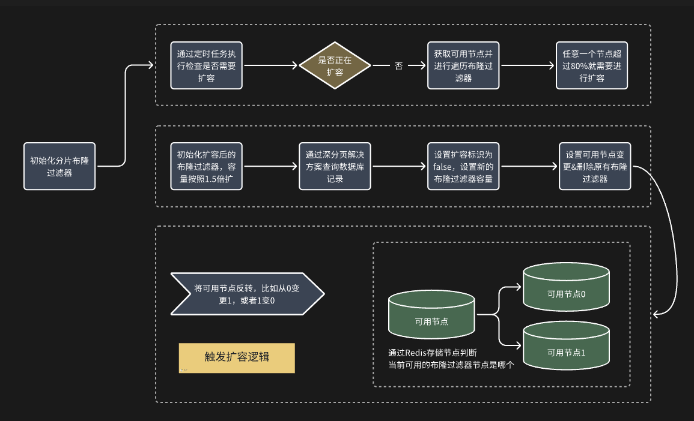

## 问题概述

我们在使用布隆过滤器的时候，在业务量小情况下使用没有任何问题，但是随着业务量逐渐变大，会暴露两个问题：

- 布隆过滤器如何存储海量数据？比如可以一次性存储 300 亿元素么？
    
- 我预估未来 10 年的数据量在 300 亿，如果在几年内超过了这个数据量触发大量的误判如何实现在线扩容？

## 布隆过滤器如何存储海量数据？

### 复现布隆过滤器海量数据问题

布隆过滤器的容量就取决于业务的数量，如果需要用到布隆过滤器的数据库表量比较大，是不是直接设置为布隆过滤器的容量就好了？

不行的，你可以尝试下设置 300 亿预估元素以及千分之一的误判率，绝对会报错。因为
```Java
Bloom filter size can't be greater than 4294967294. But calculated size is 431327626981
```
简单梳理了下，意思是：布隆过滤器大小不能超过 4294967294，但是咱们的参数 300 亿预估值和 千分之一的误判率，已经超过了这个数据。

如果设置 300 亿数据预估值但是设置百分之一的误判率，那么报错就换了一个。可以看到布隆过滤器给我们设置了上限，不能超过。

```Java
Bloom filter size can't be greater than 4294967294. But calculated size is 287551751321
```

### 布隆过滤器占多少空间？

一个亿的元素，如果千分之一的误判率，那么实际容量大概在 170M 左右。另外在对布隆过滤器进行初始化的时候，会一次性申请对应的内存，这个需要额外注意下，避免初始化超大容量布隆过滤器时内存不足问题。
### Hash 函数分片存储
那这种情况下如何解决布隆过滤器不能设置 300 亿数据问题？

可以设置多个布隆过滤器，使得这些分片的布隆过滤器总容量能达到 300 亿。然后根据指定规则进行 Hash 分片，确定要操作的布隆过滤器，从而在该分片上进行操作。

当然这样也有个缺陷，那就是时间复杂度增加了，从原先的O（k）到现在的O（nk）
k指的是布隆过滤器的哈希次数，n指的是布隆过滤器的个数。
那么怎么解决这个问题呢？没错，还是哈希，我将每个短链接进行一个哈希到idx下标下的布隆过滤器。那么就可以将O（nk）变为O（k + 1）了。

```Java
// 比如1个分片设置1个亿的元素，300个布隆过滤器刚好设置300亿
for (int i = 0; i < 300; i++) {
    RBloomFilter<String> bloomFilter = redissonClient.getBloomFilter(String.format("sharding-expansion:short-link-create-bloom-filter-%s-%d", bloomFilterCurrentIndex, i));
    bloomFilter.tryInit(100000000L, 0.001);
}
```
## 海量数据如何实现在线扩容？（双可用机制）

那么在项目初期肯定不能一下就上这么大内存空间来存布隆过滤器，虽然说位图占用没那么大，但是这么大的布隆过滤器要是只存放那么一丁点大的数据量，完全就是原子弹打蚊子。

但是呢，我们又不能说停机去扩容一下，然后再上线。就算是放在凌晨进行数据的扩容，那么也是对用户不太友好的。那么就可以使用我下面说的这种方式：双可用机制。

虽然说是双可用机制吧，但是实际上占用的内存其实只有一块。在短链接系统中，对于这个问题我采用redis的三个变量进行扩容操作和短链接在布隆过滤器上的映射。在扩容另一个布隆过滤器的时候，原先的布隆过滤器也可以使用，在扩容完毕后通过redis的标志位来进行布隆过滤器的切换，这个过程用户是无感知的。

* sharding-expansion:bloom_filter_size 布隆过期器大小  
* sharding-expansion:bloom_filter_current_index 当前布隆过滤器为0号还是1号  
* sharding-expansion:expansion_flag 是否正在扩容

分别讲解一下这三个的用意：
第一个的作用有两个：一个是要对短链接进行取模哈希到对应的布隆过滤器，第二个就是需要定时任务去判断当前idx是否需要扩容。
第二个也就是我们双可用的核心：如果我们当前是0号布隆，扩容的就是1号布隆，然后再将redis中的值修改为1，这样再去判断就是我们新的扩容的布隆过滤器了。
第三个主要是互斥的作用：就像解决缓存击穿的逻辑过期一样，一个时间只需要一个线程去重构缓存就行了，这边也就是只需要一个线程去扩容布隆过滤器。

使用图梳理扩容的逻辑，扩容落地的策略采用短链接项目的新增和访问短链接接口。


或者说不必要遍历，而只需要看最后一个布隆过滤器的count / size >= 0.8，若大于则需要扩容
在扩容过程中，判断count值是否超出预期。若超出则需要新建一个布隆过滤器，否则只需要对其进行1.5倍扩容即可。

同时这个过程中，其实还会出现其他的问题：
- 大批量的数据迁移到布隆过滤器，一次把数据查出大概率会OOM，那么我们就采用分片进行同步。
- 深度分页的问题，因为如果是limit的话会遍历前面的元素，导致性能下降的问题，那么我们就可以记录上一个的id然后再进行查询
- 同步过程中有新的数据插入的问题，那么我们再查询一次数据库新增到布隆过滤器中，如果在这个时候还有新的插入，那么我们在创建短链接中设置了短链接唯一索引，如果说出现了唯一索引报错，先去查看布隆是否有，没有的话对其进行新增。（算是一个兜底策略）


 这个在线的机制我同样也应用于单表到多表的平滑上线的过程中，有兴趣可以看看我另一篇博客，同时也引入了RocketMQ和Canal组件对其进行异步新增。
 
